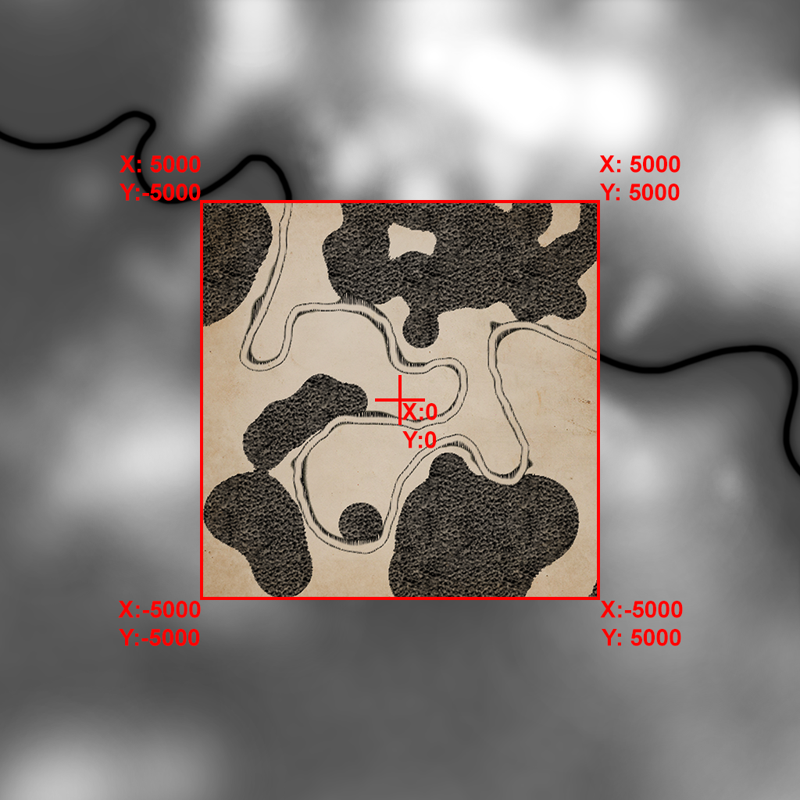

# **Unofficial OstrivSDK**
This repo contains two projects - OstrivSDK library and OstrivConverter binary.

## **OstrivSDK**
Right now lacks in-code docs, but the API is pretty simple and self-explanatory. You can load `data.data`, `.minimap` and `.level_save` files, export them, import them and/or save them. This should make it possible to implement some basic level editor for example.

### **Minimap file**
Contains 1024x1024 RGB pixels. The image saved here is used as a preview when picking a map in game menu. The actual minimap in game appears to be generated by game itself.  
Supported formats for import/export are: `.bmp`, `.gif`, `.jpeg`, `.png`, `.tiff`

### **Data file**
Is a package of game assets. It contains models, animations, textures and whatever else. There is a lot of files that have unknown extension like `.tst`, `.tst2` or `.floor`, but textures and icons are in `.png` so these can be easily modified. Export/import works like packing/unpacking a zip file, just pick a folder.

### **LevelSave**
This file is for maps and contains data on deposits, fishing spots and river flow vectors. Without deposits there is no lime/stone/iron, without fishing spots you cannot fish and without river flow vectors you can't use building that need water power to operate. Export/import is into `.yaml` file so it can be easily edited. Please read *Notable info* before any attempts to edit maps.

**Map names are hardcoded in game so we cannot add a new map, we can only replace current maps for now.** But I think that maybe if we showed interest, Yevhen would make the system more flexible.

#### **Notable info**
X, Y coordinates are horizontal, Z is vertical. Playable zone of each map is from **X: -5000 Y: -5000** to **X: 5000 Y: 5000** with **X: 0 Y: 0** in the center. In case of `.forestmap`, `.heightmap` and `.plantsmap`, which are 1024x1024px, playable zone of each map is 512x512px around the image center:  



**IMPORTANT**  
Valid deposit names are:
```
building_finite_deposit_stone
building_infinite_deposit_stone

building_finite_deposit_limestone
building_infinite_deposit_limestone

building_infinite_deposit_iron_ore
```
`variant` property of each deposit corresponds to an ingame model. For `building_finite_deposit_stone` you can assign `variant` 0, 1, 2, 3. For anything else it needs to be 0 or the game crashes.

Right now we can use `infinite` deposits only for deposits that are listed as **Unlimited** in map menu. Eg. for Map 1 you can only have `building_infinite_deposit_limestone`, for Map 2 you can only have `building_infinite_deposit_iron_ore`. Any other combinations will crash the game. I am not sure if it's hardcoded in game yet, but it might be. More research pending.

## **OstrivConverter**
This is a CLI tool that uses SDK to do all above mentioned things without needing to code.  

`ostrivconverter --help`  
### **Examples**:  
`ostrivconverter data --export -s data.data -d ostrivdata`  
to export data from `data.data` file into `ostrivdata` folder  

`ostrivconverter data --import -s ostrivdata -d data.data`  
to import data from `ostrivdata` folder to `data.data` file  

`ostrivconverter levelsave --export -s level01.level_save -d level01.yaml`  
to export data from `level01.level_save` file to `level01.yaml` file   

`ostrivconverter levelsave --import -s level01.yaml -d level01.level_save`  
to import data from `level01.yaml` file to `level01.level_data` file  

`ostrivconverter minimap --export -s level01.minimap -d level01.png`  
to export data from `level01.minimap` file to `level01.png`  

`ostrivconverter minimap --import -s level01.png -d level01.minimap`   
to import data from `level01.png` file to `level01.minimap` (bmp file has to be 1024x1024px)  

Everything can be also shortened:  
`ostrivconverter minimap -e -s level01.minimap -d level01.png`  
`ostrivconverter minimap -i -s level01.png -d level01.minimap`  
or  
`ostrivconverter minimap -es level01.minimap -d level01.png`  
`ostrivconverter minimap -is level01.png -d level01.minimap`